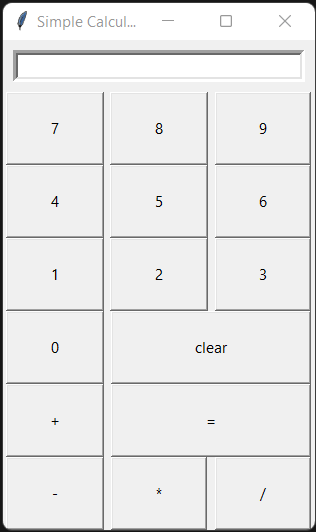
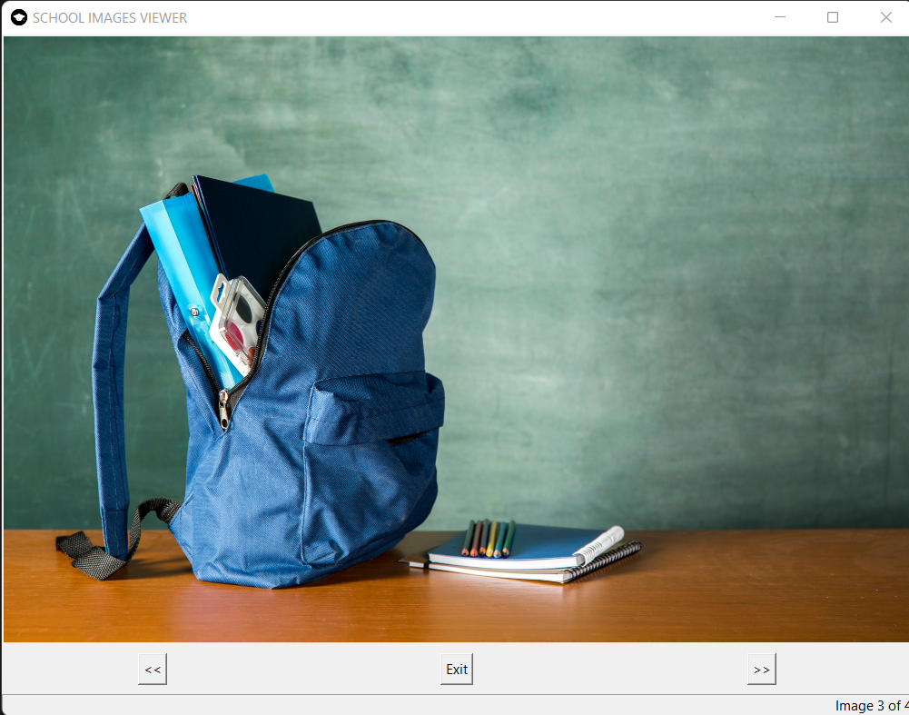
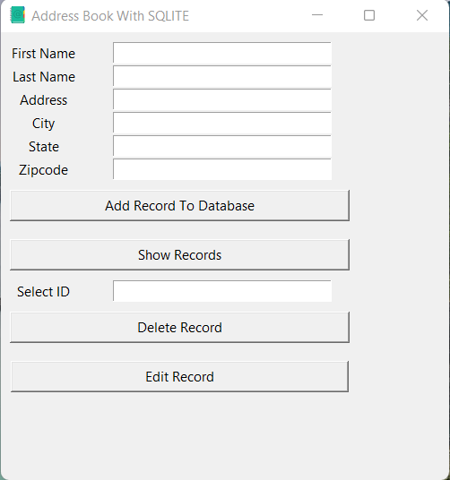

# PYTHON PROJECTS
This is a repository for all projects I have worked on to improve my python skills as a developer.
Below is a list of all the projects in this repo.
## Guess The Number.
This is a simple guessing game where there is a random number generated from a range depending on the game difficulty(easy, intermediate or hard). If the input value for the game level or guess is not accounted for, an error message shows up. For every level a specific number of attempts are allowed that you can keep guessing else it's game over. All three levels have been divided into three different functions with separate while loops so I could easily debug every level. The game also includes hints for when the number guessed is higher or lower than the random number that has been generated for the game level. Depending on wether the user gets the guess right or runs out of attempts, the game comes to an end and the right answer is displayed.

## ROLLING DICE SIMULATOR
Yet another simple game but takes than an hour to complete. In this game a user just enters yes or no to roll the die or quit the game respectively. If the user enters yes, randint is used to print a random integer from 1 to 6. The game has two levels; one for a single die roll and another for a dice roll which returns a sum of the dice.

## HANGMAN
After eight rounds of coffee and a lot of copy and pasting and some modification of course. I finished the hangman game. Trust, I thought I would bail on this. Anyway, it's your regular hangman game with some words which are just two in this case apple and orange. The basic functionality of the game being able to detect a letter and pass it as a guess and crosscheck with the random word selected is working fine. Also being able to replace the letter that still needs guessing is an added functionality.

## SIMPLE CALCULATOR
 
I needed to work on a project that has some form of graphical interface and then I found Tkinter. Trust, it is boring to look at but the basic functionalities are a stepping stone. This project is a simple calculator with just multiplication(*), subtraction(-), addition(+) & division(/) functions. Using Tkinter, I was able to make this look like an actual pocket calculator. In the future, I hope to remove the equal(=) bug that keeps executing the last task with the first number passed. Clearing after every calculation is a way around this for now. 
<strong>Ref:[Codemy](https://codemy.com/)</strong>    

## IMAGE VIEWER
 
This is a school image viewer app just to enhance my skills with Tkinter. It displays images and has a next and back button to cycle through the images. This isn't so much of a project but trust, I had to watch a Codemy video the entire time. 
<strong>Ref:[Codemy](https://codemy.com/)</strong>    

## ADDRESS_BOOK
 
This is a <strong>sqlite3+tkinter</strong> project. This address book allows the user to enter their credentials and is saved in a database which can be accessed, updated and deleted with a specific ID. This is just the first version, I'm planning on adding a hashed password to let users verify it's their account before they can use it. I'm also thinking of allowing users to allow other users to change their credentials but baby steps here.

## EMAIL SLICER
A four line project. I know! I needed my commit of the day! In later version I wish to include the option to send mail to the host.
